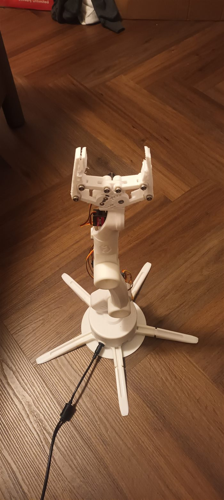
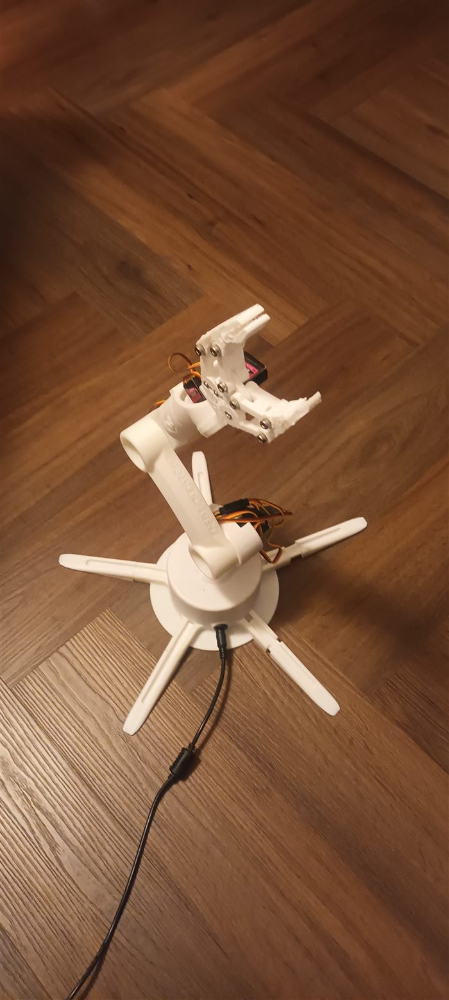
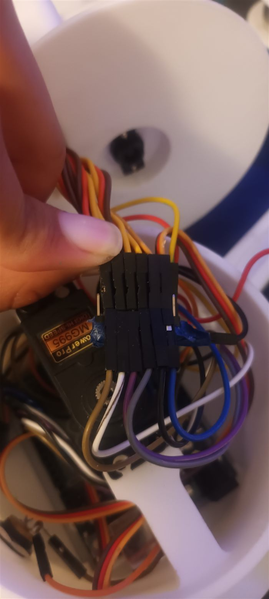

# Robotic Arm Controller

A 6-servo robotic arm I designed in FreeCAD, 3D-printed and wired to an Arduino, plus the
Python desktop app that drives it over Bluetooth. Built as my A-level Computer Science NEA (2025).

<p>
  
  
  
</p>

## What it does

- **Desktop control panel** (`main.py`, Tkinter) — one slider per servo (0–180°) and a loading screen.
- **Bluetooth link to the Arduino** — sends `"<servo> <angle>"` commands to an HC-06 module over RFCOMM.
  An asyncio loop on a background thread sends only the servos whose angle changed, so the GUI never
  blocks and the serial link isn't flooded. If Bluetooth isn't available it runs in demo mode.
- **Xbox controller input** (`ControllerSupport.py`) — reads the gamepad on its own thread and
  normalises the joysticks and triggers to -1…1.
- **Inverse kinematics prototype** (`TestIK.py`, `robot.urdf`) — a URDF model of the arm loaded into
  `ikpy`, which solves for joint angles from a target position and checks the answer with forward kinematics.
- **Voice commands prototype** (`VoiceRecognition.py`) — "move up / left / right / down" through speech recognition.

## Run it

```
pip install pillow ikpy
python main.py
```

The HC-06 address is set in `main.py`. The app can also be packaged into a single `.exe` with PyInstaller (`main.spec`).

## What I'd do next

Wire the IK solver into the main app so you move the gripper to a point instead of setting each joint by hand,
and replace the sliders with live controller input.
